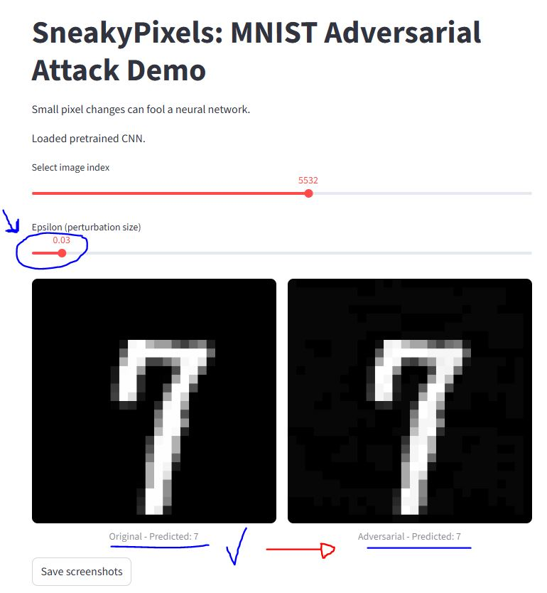
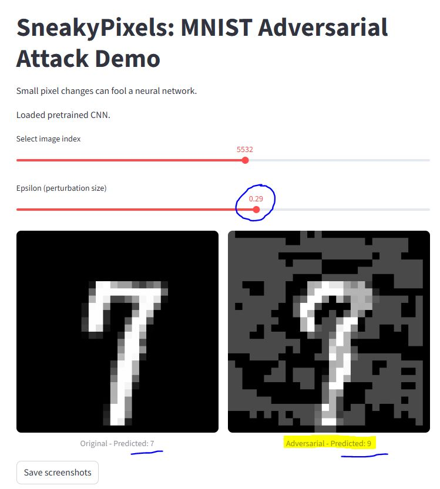
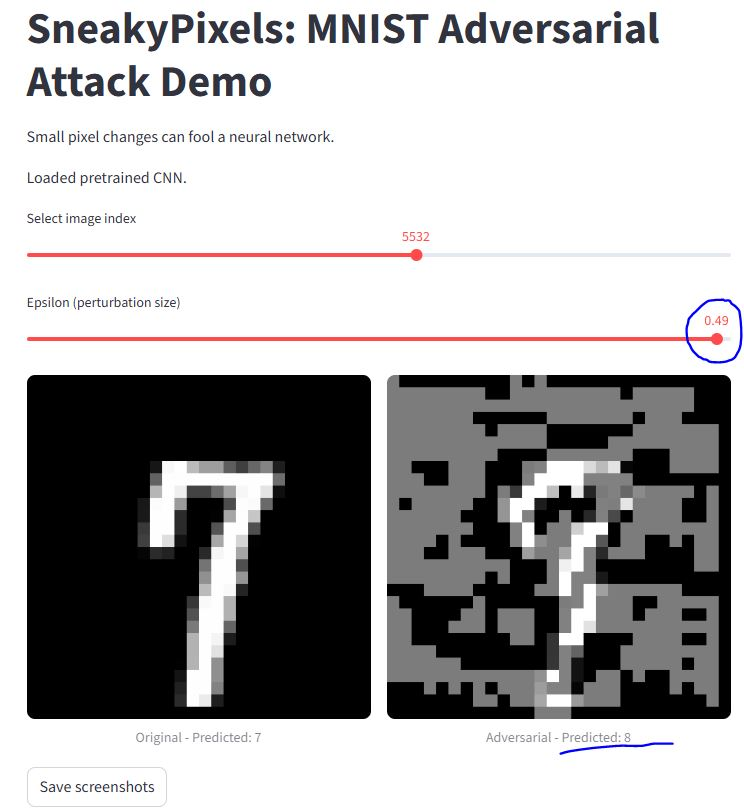
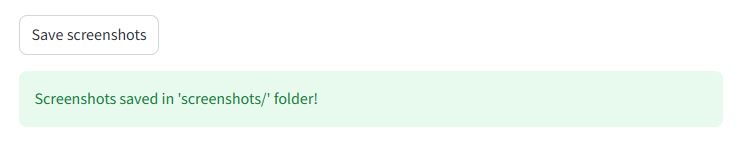
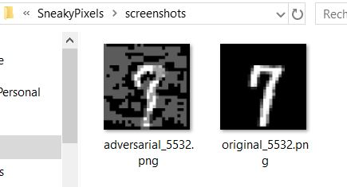

# SneakyPixels — MNIST Adversarial Attack Demo (Streamlit)

**SneakyPixels** is a small Streamlit demo that shows how *Tiny pixel perturbations* can fool a neural network trained on MNIST using the FGSM (Fast Gradient Sign Method) attack.

This repository includes:
- A Streamlit app that trains/loads a small CNN on MNIST 
- An FGSM implementation to craft adversarial images.
- A UI to slide the perturbation size (epsilon) and save screenshots.

## Demo / Screenshots

### Case 1 — Small perturbation (epsilon = 0.03)

->prediction stays correct since the perturbation size is tiny

### Case 2 — Medium perturbation (epsilon = 0.29)

**Adversarial (predicted):** 9 → *prediction becomes wrong (predicted 9 when original was 7)*

### Case 3 — Large perturbation (epsilon = 0.49)

**Adversarial (predicted):** 8 — *prediction changed wrongly (now predicts 8); perturbation size is large

## Saving screenshots

If you want to save the original and adversarial images you tested, simply **click the "Save screenshots" button** in the app.  

- The app will automatically save both the original and adversarial images in a folder named `screenshots/`.  
- If the folder does not exist, it will be **created automatically**.  
- You can then use these saved images to illustrate different perturbation sizes and how they affect the predictions.




## Setup 

## MNIST Dataset

The MNIST handwritten digits dataset is **automatically downloaded** the first time you run the app.  

- It will be saved in the `./data/` folder.  
- You **do not need to download it manually**. 

## 🧠 Pretrained Model

The app requires the pretrained CNN model (`mnist_cnn.pth`). You can either:

- **Download it** from Dropbox and place it in the project root:  
[Download mnist_cnn.pth](https://www.dropbox.com/scl/fi/5n0hpbew4i2oy1dlf989b/mnist_cnn.pth?rlkey=cmk3wuy7487xsoevbnzc9g1ew&st=t6o1qmmt&dl=0)

- **OR train it yourself** automatically by running the app.
```bash
# 1.1 Create virtual environment (optional but recommended)
python -m venv pixel

# 1.2 Activate on Windows
pixel\Scripts\activate

# 1.2 Activate on Linux/macOS
source pixel/bin/activate

# 2. installation
pip install --upgrade pip
pip install streamlit pillow numpy
pip install --index-url https://download.pytorch.org/whl/cpu torch torchvision

## 3. Run the Streamlit app
streamlit run main.py


